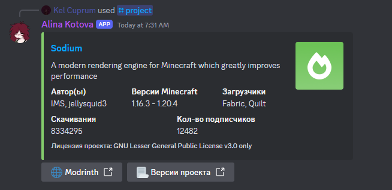

<h1> Alina </h1>

Модульный бот и с возможностью кастомизации, который написанный на Java.

### Модули
- [MODULES.MUSIC] Музыкальная часть бота, которая помогает послушать музыку с другими участниками. Доступные сервисы описаны в [WaterPlayer](https://github.com/kel-cu/waterplayer)
- [MODULES.MODRINTH] Модуль, который показывает разную информацию из Modrinth

### Примеры сообщений
`/project id:sodium`

`/play url:https://music.yandex.ru/album/18374095/track/91956076`

### Локализация
В боте присуствует возможность менять локализацию, то есть вы можете перевести всю локализацию на свой родной язык. 
Готовые варианты локализации доступны в папке [localization](localization).

Локализация бота хранится в корне папки бота, в файле `localization.json`

### Конфигурация
Конфиги бота хранятся в корне папки бота, в файле `config.json`.  
Структура выглядит так: 
**config.json**
- TOKEN: String - Токен дискорд бота
- MUSIC [Формат: `MUSIC.TYPE`]
  - YANDEX_MUSIC_TOKEN: String - Токен пользователя в Я.Музыки
  - DEEZER_DECRYPTION_KEY: String - Ключ Deezer
  - FLOWERY_TTS_VOICE: String - Голос Flowery TTS
  - SPOTIFY_CLIENT_ID: String - Client ID Spotify
  - SPOTIFY_CLIENT_SECRET: String - Client Secret Spotify
  - SPOTIFY_COUNTRY_CODE: String - Код страны для сервиса (Из РФ рекомендую ставить Казахстан: KZ)
  - APPLE_MUSIC_MEDIA_API_TOKEN: String - Токен А.Музыки
  - APPLE_MUSIC_COUNTRY_CODE: String - Код страны для сервиса
  - ENABLE_YOUTUBE: Boolean - Загружать ли ссылки из YouTube (Spotify зависит от Ютуба)
  - ENABLE_SOUNDCLOUD: Boolean - Загружать ли ссылки из SoundCloud
  - ENABLE_BANDCAMP: Boolean - Загружать ли ссылки из Bandcamp
  - ENABLE_VIMEO: Boolean - Загружать ли ссылки из Vimeo
  - ENABLE_TWITCH: Boolean - Загружать ли ссылки из Twitch
  - ENABLE_BEAM: Boolean - Загружать ли ссылки из Beam
- modrinth-api: String - Ссылка на API Modrinth
- modrinth-site: String - Ссылка на Modrinth

